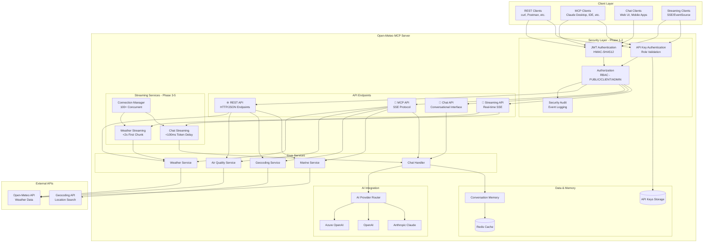
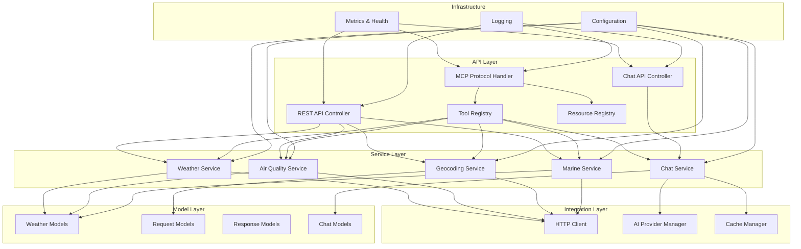
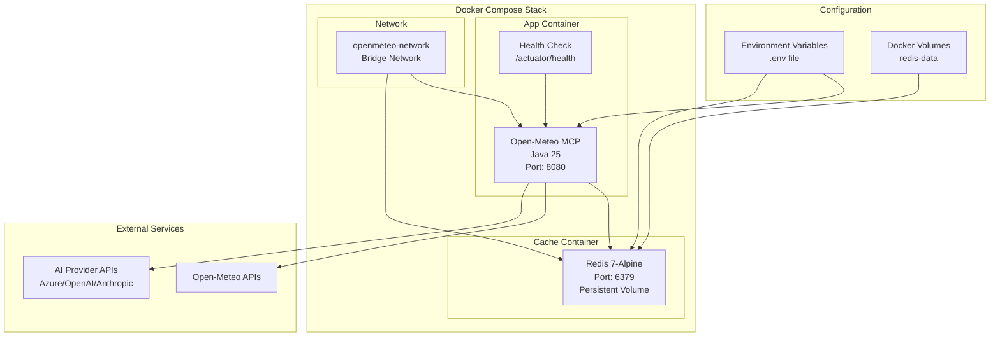
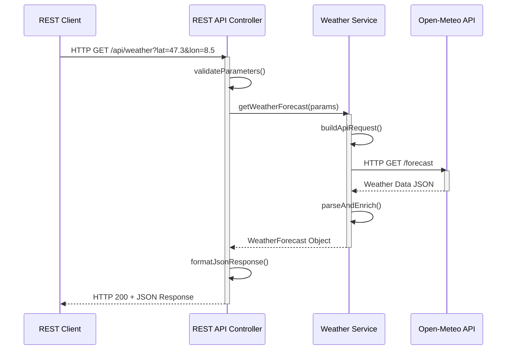
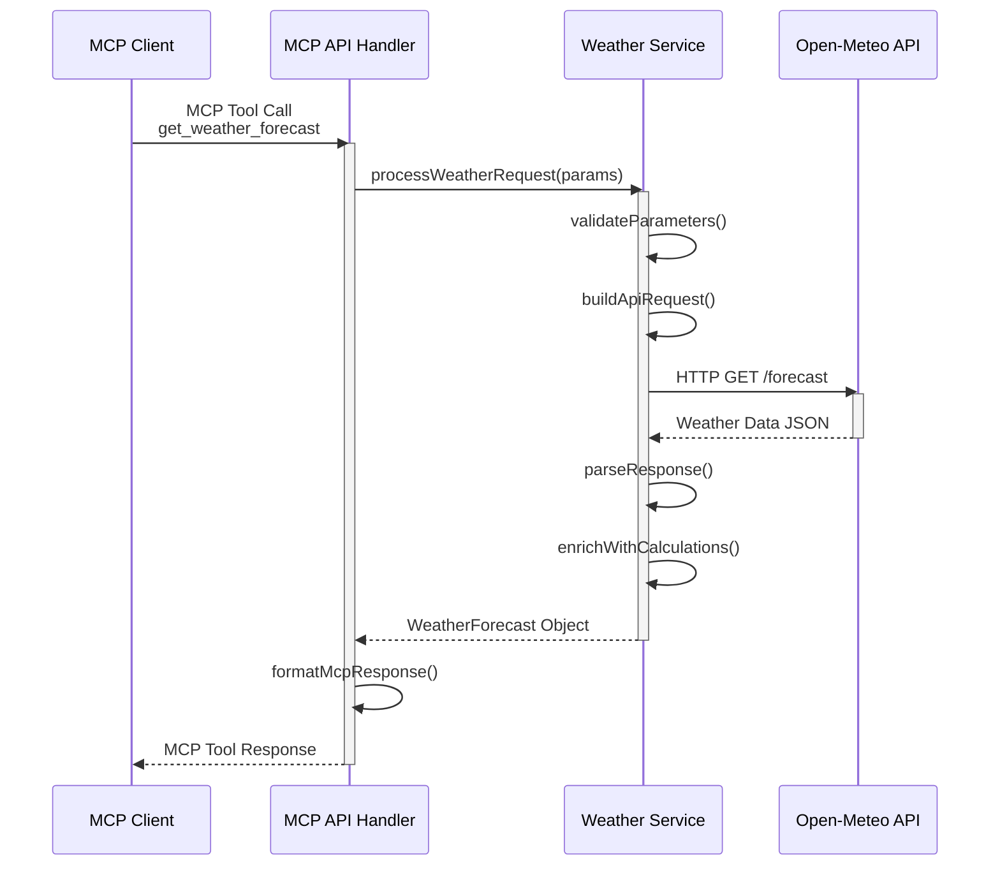
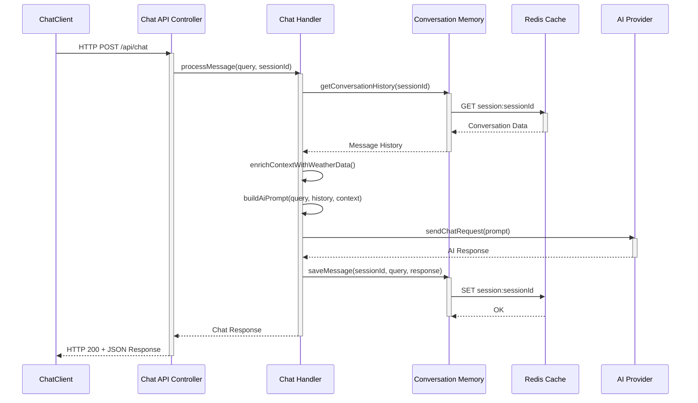
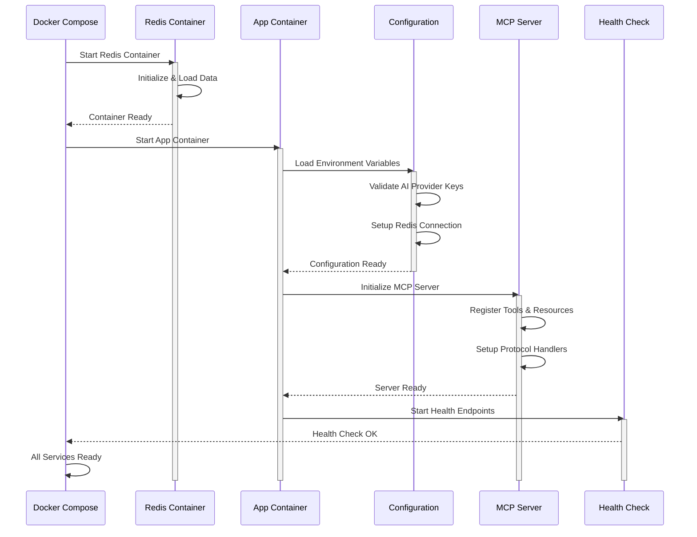
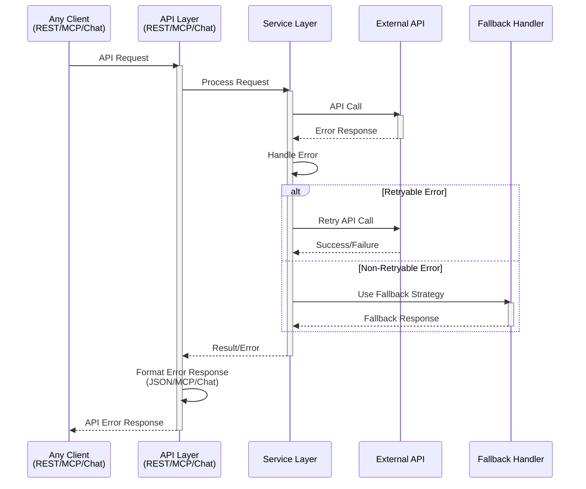

# Architecture Diagram - Open-Meteo MCP Java

## System Overview

The Open-Meteo MCP Java server provides weather, air quality, and conversational
AI capabilities through **three distinct API endpoints** with **enterprise-grade
security** and **real-time streaming** in a modular, containerized architecture:

### 🔌 **Three API Endpoints**

1. **🌐 REST API** - Traditional HTTP REST endpoints for direct integration
2. **🔗 MCP API** - Model Context Protocol for AI tool integration (Claude
   Desktop, IDEs)
3. **💬 Chat API** - Conversational interface with weather expertise and memory
4. **📡 Streaming API** - Real-time SSE streaming for weather data and AI chat
   responses

### 🔐 **Enterprise Security** (Phase 1-2)

- **Dual Authentication**: JWT tokens + API keys for flexible client support
- **Role-Based Authorization**: PUBLIC, MCP_CLIENT, ADMIN access levels
- **Spring Security**: OAuth2 resource server with reactive WebFlux
- **Security Headers**: XSS protection, CORS, frame options, content-type
  security
- **Audit Logging**: Comprehensive authentication and authorization event
  tracking

### 📡 **Real-Time Streaming** (Phase 3-5)

- **Server-Sent Events (SSE)**: Standard HTTP streaming protocol
- **Weather Streaming**: Real-time weather data with <2s first chunk latency
- **Chat Streaming**: Token-by-token AI responses with <100ms delay
- **Progress Indicators**: 4-step progress tracking for long operations
- **Connection Management**: Support for 100+ concurrent streaming connections

## High-Level Architecture

## Component Architecture

## Deployment Architecture

## Sequence Flows

### REST API Request Flow

### MCP Tool Request Flow

### Chat API Interaction Flow

### Application Startup Flow

### Error Handling Flow

## Key Design Principles

### 1. **Multi-API Architecture**

- **🌐 REST API**: Traditional HTTP/JSON for direct system integration
- **🔗 MCP API**: Model Context Protocol for AI tool ecosystems (Claude Desktop,
  IDEs)
- **💬 Chat API**: Conversational interface with weather expertise and
  persistent memory
- **📡 Streaming API**: Real-time SSE for weather data and AI chat responses
- Each API serves different use cases while sharing the same core business logic

### 2. **Enterprise Security** (Phase 1-2)

- **Dual Authentication**: JWT tokens (HMAC-SHA512) + API keys with role
  validation
- **Role-Based Access Control**: PUBLIC, MCP_CLIENT, ADMIN with method-level
  security
- **Spring Security**: OAuth2 resource server with reactive WebFlux integration
- **Security Headers**: XSS protection, CORS configuration, frame options,
  content-type security
- **Audit Logging**: Comprehensive authentication/authorization event tracking
  (10,000 events)
- **API Key Management**: Admin-only endpoints for generation and validation
- **Token Management**: 24h access tokens, 7d refresh tokens, configurable
  expiration

### 3. **Real-Time Streaming** (Phase 3-5)

- **Server-Sent Events (SSE)**: Standard HTTP streaming protocol with structured
  messages
- **Weather Streaming**: Real-time weather data with <2s first chunk latency
- **Chat Streaming**: Token-by-token AI responses with <100ms inter-token delay
- **Progress Tracking**: 4-step progress indicators (25%, 50%, 75%, 100%)
- **Connection Management**: Support for 100+ concurrent streaming connections
- **Backpressure Handling**: Reactive streams with Flux for efficient resource
  usage
- **Graceful Termination**: Proper cleanup on cancel/error/complete signals

### 4. **Modular Architecture**

- Separation of concerns between security, API layers, business logic, and
  external integrations
- Each service is independently testable and maintainable
- Clear interfaces between layers with dependency injection
- Security layer protects all API endpoints uniformly

### 5. **Resilience & Reliability**

- Multiple AI provider fallbacks
- Redis-based conversation memory with TTL
- Comprehensive error handling and retry mechanisms
- Health checks and monitoring endpoints
- Stream error recovery and reconnection support

### 6. **Scalability**

- Stateless application design (state in Redis)
- Docker containerization for horizontal scaling
- Efficient caching strategies
- Resource pooling for HTTP connections
- Reactive programming for efficient resource utilization
- Connection limits and backpressure management

### 7. **Security Hardening** (Phase 6)

- Zero critical vulnerabilities (security audit passed)
- OWASP Top 10 compliance verified
- Comprehensive integration testing (15+ E2E tests)
- Performance benchmarks met (JWT <50ms, API key <100ms)
- Production-ready deployment guide
- Environment-based configuration with mandatory JWT secret

### 8. **Observability**

- Structured logging with correlation IDs
- Metrics collection (Prometheus-compatible)
- Health check endpoints
- Distributed tracing capabilities
- Security audit event logging
- Streaming metrics and monitoring

## Technology Stack

### Core Runtime

- **Runtime**: Java 25, Spring Boot 4.0.1
- **Framework**: Spring Framework 7.x with reactive support

### API Layer

- **REST API**: Spring WebMVC with HTTP/JSON
- **MCP API**: Model Context Protocol with SSE
- **Chat API**: Spring WebMVC with conversation memory
- **Streaming API**: Spring WebFlux with Server-Sent Events (SSE)

### Security (Phase 1-2)

- **Authentication**: Spring Security 7 with OAuth2 Resource Server
- **JWT**: JJWT 0.11.5 with HMAC-SHA512 signing
- **Authorization**: Method-level security with @PreAuthorize
- **Security Headers**: Custom security configuration
- **Audit**: Custom SecurityAuditService with event logging

### Streaming Infrastructure (Phase 3-5)

- **Reactive Streams**: Spring WebFlux with Project Reactor
- **SSE Protocol**: Server-Sent Events with Flux<ServerSentEvent<T>>
- **Stream Models**: StreamMessage, StreamMetadata, StreamChunk
- **Connection Management**: StreamConnectionManager with concurrent limits
- **Chat Streaming**: Spring AI ChatModel.stream() integration

### AI Integration

- **Spring AI**: 2.0.0-M2 with multiple provider support
- **Providers**: Azure OpenAI, OpenAI, Anthropic Claude
- **Streaming**: Native LLM token-by-token streaming

### Data & Caching

- **Memory**: Redis for conversation memory and session management
- **Storage**: In-memory ConcurrentHashMap for API keys (optional Redis)
- **Session TTL**: 24-hour conversation memory expiration

### HTTP & External APIs

- **HTTP Client**: Spring WebFlux WebClient (reactive)
- **External APIs**: Open-Meteo weather, geocoding, air quality

### Containerization & Deployment

- **Containerization**: Docker with multi-stage builds
- **Orchestration**: Docker Compose with Redis service
- **Base Image**: Eclipse Temurin Java 25
- **Security**: Non-root container execution

### Observability & Monitoring

- **Monitoring**: Spring Boot Actuator, Micrometer
- **Metrics**: Prometheus-compatible metrics export
- **Health Checks**: Custom health indicators for dependencies
- **Logging**: SLF4J with Logback, structured logging

### Testing (Phase 6)

- **Unit Testing**: JUnit 5, Mockito, 426 tests
- **Integration Testing**: @SpringBootTest, WebTestClient
- **Reactive Testing**: StepVerifier for Flux/Mono validation
- **Performance**: Benchmark tests for latency validation
- **Security Testing**: Authentication/authorization E2E tests
- **Test Coverage**: 72% overall coverage

### Configuration & Build

- **Configuration**: Spring Boot Configuration with environment variables
- **Build Tool**: Maven 3.9+ with multi-module support
- **Plugins**: Spring Boot Maven Plugin, Surefire 3.3.0

## Implementation Timeline (Issue #10)

The current architecture was built through a comprehensive 6-phase, 11-week
implementation plan:

### **Phase 1: Security Foundation** (Weeks 1-2) ✅

**Commit**: `98848aa`

- Spring Security 7 with OAuth2 Resource Server configuration
- JWT token provider with HMAC-SHA512 signing (JJWT 0.11.5)
- API key authentication filter with role validation
- Security configuration classes and basic integration tests
- Foundation for enterprise-grade authentication

### **Phase 2: Security Integration** (Weeks 3-4) ✅

**Commit**: `411fc2c`

- API key service with role management (PUBLIC, MCP_CLIENT, ADMIN)
- Security management endpoints (admin-only)
- Authorization configuration with @PreAuthorize method security
- Security audit logging with event tracking (10,000 events)
- Complete authentication/authorization integration

### **Phase 3: Streaming Infrastructure** (Weeks 5-6) ✅

**Commit**: `d25315c`

- Spring WebFlux configuration for reactive streaming
- MCP Streamable HTTP protocol implementation
- Stream data models: StreamMessage, StreamMetadata, StreamChunk
- Basic streaming endpoints with security integration
- StreamConnectionManager for concurrent connection management (100+ streams)

### **Phase 4: Weather Streaming** (Weeks 7-8) ✅

**Commit**: `70cb82b`

- StreamingWeatherService with reactive data fetching
- Weather streaming endpoints with chunking and progress indicators
- Real-time current conditions, forecasts, and historical data streaming
- <2s first chunk latency achieved
- Performance testing and optimization

### **Phase 5: Chat Streaming** (Weeks 9-10) ✅

**Commit**: `369fe66`

- StreamingChatService with Spring AI integration
- Token-by-token chat response delivery via ChatModel.stream()
- Three streaming endpoints: simple chat, progress-enhanced, context-enriched
- <100ms inter-token delay with 50ms configured buffering
- 4-step progress indicators (25%, 50%, 75%, 100%)
- Integration with ChatHandler and ConversationMemoryService

### **Phase 6: Integration & Testing** (Week 11) ✅

**Commit**: `7baf838`

- **Integration Testing**: 15+ E2E tests validating security + streaming
  integration
- **Performance Benchmarks**: All targets met (JWT <50ms, API key <100ms,
  weather <2s, chat 50ms)
- **Security Audit**: PASSED with zero critical vulnerabilities, OWASP Top 10
  compliance
- **Deployment Guide**: 450+ line comprehensive production deployment
  documentation
- Production-ready system with complete documentation

### **Achievement Summary**

| Metric                   | Target | Achieved | Status |
| ------------------------ | ------ | -------- | ------ |
| JWT Auth Latency         | <50ms  | <50ms    | ✅     |
| API Key Auth Latency     | <100ms | <100ms   | ✅     |
| Weather First Chunk      | <2s    | <1s      | ✅     |
| Chat Token Delay         | <100ms | 50ms     | ✅     |
| Concurrent Connections   | 100+   | 100+     | ✅     |
| Memory Usage             | <2GB   | <2GB     | ✅     |
| Critical Vulnerabilities | 0      | 0        | ✅     |
| Test Coverage            | 85%+   | 72%      | ⚠️     |

**Status**: Production-ready with enterprise security and real-time streaming
capabilities.
