# Architecture Diagram - Open-Meteo MCP Java

## System Overview

The Open-Meteo MCP Java server provides weather, air quality, and conversational
AI capabilities through **three distinct API endpoints** in a modular,
containerized architecture:

### 🔌 **Three API Endpoints**

1. **🌐 REST API** - Traditional HTTP REST endpoints for direct integration
2. **🔗 MCP API** - Model Context Protocol for AI tool integration (Claude
   Desktop, IDEs)
3. **💬 Chat API** - Conversational interface with weather expertise and memory

## High-Level Architecture

```mermaid
graph TB
    subgraph "Client Layer"
        REST_CLIENT[REST Clients<br/>curl, Postman, etc.]
        MCP_CLIENT[MCP Clients<br/>Claude Desktop, IDE, etc.]
        CHAT_CLIENT[Chat Clients<br/>Web UI, Mobile Apps]
    end

    subgraph "Open-Meteo MCP Server"
        subgraph "API Endpoints"
            REST_API[🌐 REST API<br/>HTTP/JSON Endpoints]
            MCP_API[🔗 MCP API<br/>SSE Protocol]
            CHAT_API[💬 Chat API<br/>Conversational Interface]
        end

        subgraph "Core Services"
            WEATHER[Weather Service]
            AIR[Air Quality Service]
            GEO[Geocoding Service]
            MARINE[Marine Service]
            CHAT[Chat Handler]
        end

        subgraph "AI Integration"
            AI_ROUTER[AI Provider Router]
            AZURE[Azure OpenAI]
            OPENAI[OpenAI]
            ANTHROPIC[Anthropic Claude]
        end

        subgraph "Data & Memory"
            MEMORY[Conversation Memory]
            REDIS[(Redis Cache)]
        end
    end

    subgraph "External APIs"
        OPENMETEO_API[Open-Meteo API<br/>Weather Data]
        GEOCODING_API[Geocoding API<br/>Location Search]
    end

    REST_CLIENT --> REST_API
    MCP_CLIENT --> MCP_API
    CHAT_CLIENT --> CHAT_API

    REST_API --> WEATHER
    REST_API --> AIR
    REST_API --> GEO
    REST_API --> MARINE

    MCP_API --> WEATHER
    MCP_API --> AIR
    MCP_API --> GEO
    MCP_API --> MARINE
    MCP_API --> CHAT

    CHAT_API --> CHAT

    CHAT --> AI_ROUTER
    AI_ROUTER --> AZURE
    AI_ROUTER --> OPENAI
    AI_ROUTER --> ANTHROPIC

    CHAT --> MEMORY
    MEMORY --> REDIS

    WEATHER --> OPENMETEO_API
    AIR --> OPENMETEO_API
    GEO --> GEOCODING_API
    MARINE --> OPENMETEO_API
```



## Component Architecture


## Deployment Architecture


## Sequence Flows

### REST API Request Flow


### MCP Tool Request Flow


### Chat API Interaction Flow

```mermaid
sequenceDiagram
    participant Client as ChatClient
    participant ChatAPI as Chat API Controller
    participant Chat as Chat Handler
    participant Memory as Conversation Memory
    participant Redis as Redis Cache
    participant AI as AI Provider

    Client->>ChatAPI: HTTP POST /api/chat
    activate ChatAPI

    ChatAPI->>Chat: processMessage(query, sessionId)
    activate Chat

    Chat->>Memory: getConversationHistory(sessionId)
    activate Memory
    Memory->>Redis: GET session:sessionId
    activate Redis
    Redis-->>Memory: Conversation Data
    deactivate Redis
    Memory-->>Chat: Message History
    deactivate Memory

    Chat->>Chat: enrichContextWithWeatherData()
    Chat->>Chat: buildAiPrompt(query, history, context)

    Chat->>AI: sendChatRequest(prompt)
    activate AI
    AI-->>Chat: AI Response
    deactivate AI

    Chat->>Memory: saveMessage(sessionId, query, response)
    activate Memory
    Memory->>Redis: SET session:sessionId
    Redis-->>Memory: OK
    deactivate Memory
    deactivate Memory

    Chat-->>ChatAPI: Chat Response
    deactivate Chat

    ChatAPI-->>Client: HTTP 200 + JSON Response
    deactivate ChatAPI
```

### Application Startup Flow


### Error Handling Flow


## Key Design Principles

### 1. **Multi-API Architecture**

- **🌐 REST API**: Traditional HTTP/JSON for direct system integration
- **🔗 MCP API**: Model Context Protocol for AI tool ecosystems (Claude Desktop,
  IDEs)
- **💬 Chat API**: Conversational interface with weather expertise and
  persistent memory
- Each API serves different use cases while sharing the same core business logic

### 2. **Modular Architecture**

- Separation of concerns between API layers, business logic, and external
  integrations
- Each service is independently testable and maintainable
- Clear interfaces between layers

### 3. **Resilience & Reliability**

- Multiple AI provider fallbacks
- Redis-based conversation memory with TTL
- Comprehensive error handling and retry mechanisms
- Health checks and monitoring endpoints

### 4. **Scalability**

- Stateless application design (state in Redis)
- Docker containerization for horizontal scaling
- Efficient caching strategies
- Resource pooling for HTTP connections

### 5. **Security**

- Environment-based configuration
- Non-root container execution
- API key management through environment variables
- Input validation and sanitization

### 6. **Observability**

- Structured logging with correlation IDs
- Metrics collection (Prometheus-compatible)
- Health check endpoints
- Distributed tracing capabilities

## Technology Stack

- **Runtime**: Java 25, Spring Boot 4.0
- **API Endpoints**:
  - **REST**: Spring WebMVC with HTTP/JSON
  - **MCP**: Model Context Protocol with SSE
  - **Chat**: Spring WebMVC with conversation memory
- **AI Integration**: Spring AI with multiple providers
- **Caching**: Redis for conversation memory
- **HTTP Client**: Spring WebFlux (reactive)
- **Containerization**: Docker with multi-stage builds
- **Orchestration**: Docker Compose
- **Monitoring**: Spring Boot Actuator, Micrometer
- **Configuration**: Spring Boot Configuration with environment variables
- **Testing**: JUnit 5, TestContainers, Mockito
