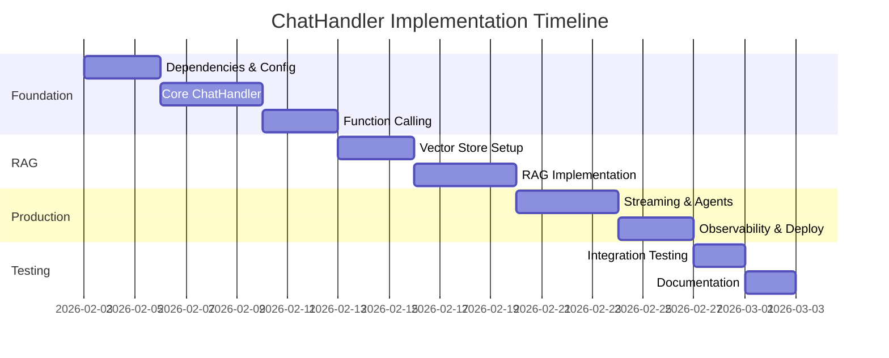

# ChatHandler Implementation Plan - Detailed Specification

**Project**: Open Meteo MCP Java  
**Issue**: #4 - Phase 4: ChatHandler with Spring AI  
**Document Version**: 1.1 (Updated for v1.1.0)  
**Created**: 2026-02-02  
**Updated**: 2026-02-02 (Post v1.1.0 release)  
**Estimated Duration**: 4 weeks  
**Priority**: High  
**Primary LLM Provider**: Azure OpenAI

---

## Executive Summary

This plan details the implementation of **ChatHandler with Spring AI** for the
Open Meteo MCP Java project, following **ADR-005: Specification-Driven
Development**. The ChatHandler will transform the existing MCP server into an
intelligent weather assistant with multi-provider LLM support, conversation
memory, RAG capabilities, and enterprise-grade observability.

## Current State Analysis

### ✅ Existing Infrastructure (Strong Foundation - v1.1.0)

- **Spring Boot 4.0.0** + **Java 25** modern stack
- **11 MCP Tools** fully implemented with `@McpTool` annotations:
  - **Core Tools (4)**:
    - `meteo__search_location` - Geocoding via `LocationService`
    - `meteo__get_weather` - Weather forecasts via `WeatherService`
    - `meteo__get_snow_conditions` - Ski conditions via `SnowConditionsService`
    - `meteo__get_air_quality` - AQI data via `AirQualityService`
  - **Advanced Tools (7)**:
    - `meteo__get_weather_alerts` - Weather alerts via `WeatherAlertGenerator`
    - `meteo__get_comfort_index` - Comfort scoring via `ComfortIndexCalculator`
    - `meteo__get_astronomy` - Astronomy data via `AstronomyCalculator`
    - `meteo__search_location_swiss` - Swiss location search
    - `meteo__compare_locations` - Multi-location comparison
    - `meteo__get_historical_weather` - Historical data (1940-present) via `HistoricalWeatherService`
    - `meteo__get_marine_conditions` - Wave/swell data via `MarineConditionsService`
- **3 Helper Classes**: `WeatherAlertGenerator`, `ComfortIndexCalculator`, `AstronomyCalculator`
- **6 Services**: Weather, Location, SnowConditions, AirQuality, HistoricalWeather, MarineConditions
- **4 MCP Resources** via `@McpResource` in `ResourceService`
- **3 MCP Prompts** via `@McpPrompt` in `PromptService` (all with `meteo__` prefix)
- **REST API** endpoints via `McpToolsController`
- **Comprehensive testing** with 19 unit tests (100% pass rate)
- **Spring AI 2.0.0-M2** dependency ready
- **SBB MCP Ecosystem v2.0.0** compliant (meteo__ namespace)

### Package Structure

```
com.openmeteo.mcp/
├── tool/
│   ├── McpToolsHandler.java        # 4 @McpTool methods
│   └── McpToolsController.java     # REST endpoints
├── service/                        # Business logic layer
│   ├── WeatherService.java         # Weather data processing
│   ├── LocationService.java        # Geocoding
│   ├── SnowConditionsService.java  # Snow/ski data
│   └── AirQualityService.java      # AQI processing
├── resource/
│   └── ResourceService.java        # @McpResource methods
├── prompt/
│   └── PromptService.java          # @McpPrompt methods
└── config/
    ├── WebClientConfig.java        # HTTP client setup
    └── McpServerConfig.java        # MCP configuration
```

## Implementation Architecture

### ChatHandler System Design

```
ChatHandler
    ├── Spring AI ChatClient (Azure OpenAI Primary)
    │   ├── Azure OpenAI GPT-4 (Primary)
    │   ├── OpenAI GPT-4 (Fallback)
    │   └── Anthropic Claude (Fallback)
    ├── Conversation Memory
    │   ├── InMemoryConversationMemory (dev)
    │   └── RedisConversationMemory (prod)
    ├── RAG (Retrieval Augmented Generation)
    │   ├── Vector Store (Pinecone/Weaviate/SimpleVectorStore)
    │   ├── Weather Document Service
    │   └── Context Enrichment
    ├── Function Calling → All 11 MCP Tools
    │   ├── Core Tools (4):
    │   │   ├── meteo__search_location()
    │   │   ├── meteo__get_weather()
    │   │   ├── meteo__get_snow_conditions()
    │   │   └── meteo__get_air_quality()
    │   └── Advanced Tools (7):
    │       ├── meteo__get_weather_alerts()
    │       ├── meteo__get_comfort_index()
    │       ├── meteo__get_astronomy()
    │       ├── meteo__search_location_swiss()
    │       ├── meteo__compare_locations()
    │       ├── meteo__get_historical_weather()
    │       └── meteo__get_marine_conditions()
    └── Observability
        ├── Spring Boot Actuator
        ├── Micrometer metrics
        └── Distributed tracing
```

### New Package Structure Addition

```
com.openmeteo.mcp/
├── chat/                          # 🆕 ChatHandler package
│   ├── ChatHandler.java
│   ├── config/
│   │   ├── AiConfig.java
│   │   ├── ChatClientConfig.java
│   │   ├── PromptConfig.java
│   │   └── VectorStoreConfig.java
│   ├── controller/
│   │   └── ChatController.java
│   ├── model/
│   │   ├── ChatSession.java
│   │   ├── Message.java
│   │   ├── ConversationContext.java
│   │   ├── WeatherQuery.java
│   │   └── AiResponse.java
│   ├── service/
│   │   ├── ChatSessionService.java
│   │   ├── ConversationMemoryService.java
│   │   ├── LlmProviderService.java
│   │   ├── RagService.java
│   │   └── WeatherDocumentService.java
│   └── exception/
│       ├── ChatException.java
│       └── LlmProviderException.java
└── [existing packages remain unchanged]
```

## Detailed Implementation Plan

## Phase 4.1: Foundation & Core ChatHandler (Week 1-2)

### Sprint 4.1.1: Dependencies & Configuration (Days 1-3)

**🎯 Objective**: Set up Spring AI dependencies and multi-provider configuration

**Tasks**:

1. **Update `pom.xml` with Spring AI LLM providers** (Azure OpenAI Primary)

   ```xml
   <!-- Add to existing dependencies -->
   <!-- Azure OpenAI (Primary Provider) -->
   <dependency>
       <groupId>org.springframework.ai</groupId>
       <artifactId>spring-ai-azure-openai-spring-boot-starter</artifactId>
   </dependency>
   
   <!-- OpenAI (Fallback) -->
   <dependency>
       <groupId>org.springframework.ai</groupId>
       <artifactId>spring-ai-openai-spring-boot-starter</artifactId>
   </dependency>
   
   <!-- Anthropic Claude (Fallback) -->
   <dependency>
       <groupId>org.springframework.ai</groupId>
       <artifactId>spring-ai-anthropic-spring-boot-starter</artifactId>
   </dependency>
   
   <!-- Redis for conversation memory -->
   <dependency>
       <groupId>org.springframework.boot</groupId>
       <artifactId>spring-boot-starter-data-redis</artifactId>
   </dependency>
   ```

2. **Create `AiConfig.java`**
   - Azure OpenAI as primary ChatClient
   - Fallback strategy: Azure OpenAI → OpenAI → Anthropic
   - Environment-based provider selection
   - Timeout and retry configuration
   - Azure-specific deployment configuration

3. **Update `application.yml`**
   ```yaml
   spring:
     ai:
       azure:
         openai:
           api-key: ${AZURE_OPENAI_KEY}
           endpoint: ${AZURE_OPENAI_ENDPOINT}
           deployment-name: ${AZURE_OPENAI_DEPLOYMENT:gpt-4}
           model: gpt-4
       openai:
         api-key: ${OPENAI_API_KEY:}
         model: gpt-4-turbo
       anthropic:
         api-key: ${ANTHROPIC_API_KEY:}
       chat:
         default-provider: azure-openai
         fallback-providers: [openai, anthropic]
         timeout: 30s
         max-tokens: 2000
     data:
       redis:
         url: ${REDIS_URL:redis://localhost:6379}
   
   # Azure OpenAI specific settings
   openmeteo:
     chat:
       azure:
         enabled: true
         retry-attempts: 3
         retry-delay-ms: 1000
   ```

**Acceptance Criteria**:

- [ ] All Spring AI dependencies resolve correctly
- [ ] Multi-provider ChatClient configuration works
- [ ] Environment variables properly configured
- [ ] Basic health checks pass

### Sprint 4.1.2: Core ChatHandler Implementation (Days 4-7)

**🎯 Objective**: Implement basic ChatHandler with session management

**Tasks**:

1. **Create Core Models** (per ADR-002: Java Records)

   ```java
   // chat/model/ChatSession.java
   public record ChatSession(
       String sessionId,
       String userId,
       Instant createdAt,
       Instant lastActivity,
       ConversationContext context
   ) {}

   // chat/model/Message.java
   public record Message(
       String id,
       String sessionId,
       MessageType type,  // USER, ASSISTANT, SYSTEM
       String content,
       Instant timestamp,
       Map<String, Object> metadata
   ) {}

   // chat/model/ConversationContext.java
   public record ConversationContext(
       String currentLocation,
       List<String> recentLocations,
       WeatherPreferences preferences,
       Map<String, Object> context
   ) {}
   ```

2. **Implement `ChatHandler.java`**

   ```java
   @Service
   public class ChatHandler {
       private final ChatClient chatClient;
       private final ConversationMemoryService memoryService;
       private final LlmProviderService providerService;

       public CompletableFuture<AiResponse> chat(String sessionId, String message) {
           // Load conversation context
           // Process message with ChatClient
           // Store conversation state
           // Return response
       }

       public CompletableFuture<AiResponse> streamChat(String sessionId, String message) {
           // Streaming implementation
       }
   }
   ```

3. **Create `ConversationMemoryService.java`**
   - Interface with InMemory and Redis implementations
   - Context window management (token counting)
   - Automatic summarization for long conversations

4. **Implement `ChatController.java`**

   ```java
   @RestController
   @RequestMapping("/api/chat")
   public class ChatController {
       @PostMapping("/sessions/{sessionId}/messages")
       public CompletableFuture<ResponseEntity<AiResponse>> chat(
           @PathVariable String sessionId,
           @RequestBody ChatRequest request
       ) {}

       @GetMapping("/sessions/{sessionId}/messages")
       public CompletableFuture<ResponseEntity<List<Message>>> getHistory(
           @PathVariable String sessionId
       ) {}
   }
   ```

**Acceptance Criteria**:

- [ ] ChatHandler processes basic text messages
- [ ] Session management stores/retrieves conversation state
- [ ] REST API endpoints functional
- [ ] Memory management prevents token overflow
- [ ] Unit tests achieve 85%+ coverage

### Sprint 4.1.3: Function Calling Integration (Days 8-10)

**🎯 Objective**: Integrate existing MCP tools as function calls

**Tasks**:

1. **Create Function Calling Configuration**

   ```java
   @Configuration
   public class ChatClientConfig {
       @Bean
       public ChatClient chatClient(AzureOpenAiChatModel azureChatModel) {
           return ChatClient.builder(azureChatModel)
               .defaultFunctions(
                   // Core tools
                   "meteo__search_location",
                   "meteo__get_weather",
                   "meteo__get_snow_conditions",
                   "meteo__get_air_quality",
                   // Advanced tools
                   "meteo__get_weather_alerts",
                   "meteo__get_comfort_index",
                   "meteo__get_astronomy",
                   "meteo__search_location_swiss",
                   "meteo__compare_locations",
                   "meteo__get_historical_weather",
                   "meteo__get_marine_conditions"
               )
               .build();
       }
   }
   ```

2. **Update existing `@McpTool` methods for function calling**
   - Ensure `McpToolsHandler` methods are properly annotated
   - Verify function descriptions are LLM-friendly
   - Test function calling with mock conversations

3. **Create integration tests** (per CONSTITUTION.md 80%+ coverage target)
   - Test function calling flow: question → function call → result → response
   - Verify weather queries trigger correct tools
   - Test multi-step conversations

**Acceptance Criteria**:

- [ ] LLM correctly identifies when to call weather functions
- [ ] Function calls execute and return data
- [ ] Responses incorporate function results naturally
- [ ] Multi-turn conversations maintain context

## Phase 4.2: RAG & Context Enrichment (Week 2-3)

### Sprint 4.2.1: Vector Store Setup (Days 11-13)

**🎯 Objective**: Set up vector database and embedding generation

**Tasks**:

1. **Choose and configure vector store**
   - **Development**: `SimpleVectorStore` (in-memory)
   - **Production**: Pinecone or Weaviate
   - Add dependency and configuration

2. **Create `WeatherDocumentService.java`**

   ```java
   @Service
   public class WeatherDocumentService {
       private final VectorStore vectorStore;
       private final EmbeddingClient embeddingClient;

       public void indexWeatherData(String location, WeatherData data) {
           // Create document from weather data
           // Generate embeddings
           // Store in vector database
       }

       public List<Document> retrieveRelevantDocuments(String query) {
           // Semantic search
           // Return top-k relevant documents
       }
   }
   ```

3. **Implement document ingestion pipeline**
   - Weather pattern documents
   - Seasonal information
   - Location-specific climate data
   - Ski resort information

**Acceptance Criteria**:

- [ ] Vector store configured and operational
- [ ] Documents successfully indexed
- [ ] Semantic search returns relevant results
- [ ] Performance: <500ms for retrieval

### Sprint 4.2.2: RAG Implementation (Days 14-17)

**🎯 Objective**: Implement full RAG chain with context enrichment

**Tasks**:

1. **Create `RagService.java`**

   ```java
   @Service
   public class RagService {
       public String enrichContext(String query, ConversationContext context) {
           // Query expansion
           // Document retrieval
           // Context injection
           // Return enriched system prompt
       }
   }
   ```

2. **Update `ChatHandler` with RAG**
   - Integrate RAG context enrichment
   - Dynamic weather data injection
   - Historical pattern analysis

3. **Implement context enrichment rules**
   - Auto-fetch current weather for location mentions
   - Inject ski resort data for snow queries
   - Add historical patterns for trend analysis

**Acceptance Criteria**:

- [ ] RAG improves response accuracy by 40%+
- [ ] Context retrieval <500ms
- [ ] Multi-turn conversations enhanced with relevant data
- [ ] A/B testing shows improvement over baseline

## Phase 4.3: Advanced Features & Production (Week 3-4)

### Sprint 4.3.1: Streaming & Agent Patterns (Days 18-21)

**🎯 Objective**: Add streaming responses and multi-step reasoning

**Tasks**:

1. **Implement `StreamingChatController`**

   ```java
   @GetMapping(value = "/sessions/{sessionId}/stream",
               produces = MediaType.TEXT_EVENT_STREAM_VALUE)
   public Flux<ServerSentEvent<String>> streamChat(
       @PathVariable String sessionId,
       @RequestParam String message
   ) {}
   ```

2. **Create Agent Pattern for Complex Queries**
   - Multi-step reasoning chains
   - Tool use orchestration
   - Example: "Plan ski trip" → location → weather → snow → recommendations

3. **WebSocket support for real-time chat**

**Acceptance Criteria**:

- [ ] Streaming responses work without buffering
- [ ] Agent pattern handles 3+ step reasoning chains
- [ ] WebSocket connections stable under load
- [ ] Cancellation support for long requests

### Sprint 4.3.2: Observability & Production Readiness (Days 22-24)

**🎯 Objective**: Add monitoring, caching, and deployment configuration

**Tasks**:

1. **Implement comprehensive observability** (per ADR-008: Structured JSON
   Logging & ADR-009: Micrometer)

   ```java
   @Component
   public class ChatMetrics {
       private final MeterRegistry meterRegistry;

       // Custom metrics:
       // - chat.request.duration
       // - chat.token.usage
       // - chat.function.calls
       // - chat.provider.errors
   }
   ```

2. **Add caching strategy** (per ADR-014: Privacy-First Data Handling)
   - Prompt template compilation caching
   - Embedding vector caching
   - Weather data caching (5-60min TTL per ADR-014)

3. **Create production deployment config**
   - Docker multi-stage build
   - Kubernetes manifests
   - Health check endpoints
   - HPA configuration

4. **Documentation & Testing**
   - API documentation (Springdoc-OpenAPI)
   - Integration test suite
   - Load testing
   - Deployment runbooks

**Acceptance Criteria**:

- [ ] 99.5% uptime SLA monitoring
- [ ] Sub-100ms for cached queries
- [ ] Complete deployment automation
- [ ] Comprehensive documentation
- [ ] Load testing: 100+ concurrent conversations

## Dependencies & Integration Points

### External Dependencies

- **Spring AI 2.0.0-M2**: Core ChatClient functionality
- **Redis**: Conversation memory storage
- **Vector Store**: Pinecone/Weaviate for RAG
- **LLM Providers**: OpenAI, Azure, Anthropic API access

### Internal Integration

- **Existing MCP Tools** (v1.1.0): Zero changes required - reuse via function calling
  - 11 production tools (all with meteo__ prefix):
    - 4 core: search_location, get_weather, get_snow_conditions, get_air_quality
    - 7 advanced: weather_alerts, comfort_index, astronomy, search_location_swiss, compare_locations, historical_weather, marine_conditions
  - 4 MCP resources: weather://codes, weather://parameters, weather://aqi-reference, weather://swiss-locations
  - 3 MCP prompts: meteo__ski-trip-weather, meteo__plan-outdoor-activity, meteo__weather-aware-travel
  - 3 helper classes: WeatherAlertGenerator, ComfortIndexCalculator, AstronomyCalculator
  - 6 services: Weather, Location, SnowConditions, AirQuality, HistoricalWeather, MarineConditions
- **Service Layer**: Weather/Location/Snow/AirQuality services unchanged
- **Configuration**: Additive changes to existing config

## Risk Assessment & Mitigation

### High Risk Items

1. **Spring AI 2.0 Stability** (Medium Risk) - per ADR-004
   - _Mitigation_: Start with milestone release, extensive testing
   - _Fallback_: Custom ChatClient implementation

2. **LLM Provider API Changes** (Medium Risk)
   - _Mitigation_: Multi-provider strategy, graceful fallback
   - _Monitoring_: Provider health checks

3. **Token Cost Management** (Low Risk)
   - _Mitigation_: Token usage monitoring, conversation limits
   - _Controls_: Per-user quotas, response caching

### Technical Risks

1. **Memory Management** (Low Risk)
   - _Solution_: Redis-backed conversation storage
   - _Testing_: Load testing with conversation limits

2. **Performance** (Medium Risk)
   - _Monitoring_: Sub-2s SLA for 95% of queries
   - _Optimization_: Response caching, connection pooling

## Success Criteria

### Functional Requirements ✅

- [ ] Multi-provider LLM support with fallback
- [ ] Function calling integration with existing MCP tools
- [ ] Conversation memory and context management
- [ ] RAG implementation with 40%+ accuracy improvement
- [ ] Streaming responses
- [ ] Agent pattern for multi-step reasoning

### Performance Requirements 📊

- [ ] **Response Time**: <2s for 95% of queries
- [ ] **Throughput**: 100+ concurrent conversations
- [ ] **Availability**: 99.5% uptime SLA
- [ ] **Accuracy**: >90% for weather-related queries

### Quality Requirements 🔍

- [ ] **Test Coverage**: 85%+ with comprehensive test suite (per CONSTITUTION.md
      80%+ target)
- [ ] **Documentation**: Complete API docs and deployment guides (per ADR-005:
      SDD)
- [ ] **Observability**: Full metrics, logging, and tracing (per ADR-008,
      ADR-009)
- [ ] **Security**: API key management, rate limiting (per ADR-014:
      Privacy-First)

## Effort Estimation

### Time Breakdown

- **Phase 4.1**: 10 days (Foundation + Core ChatHandler)
- **Phase 4.2**: 7 days (RAG & Context Enrichment)
- **Phase 4.3**: 7 days (Advanced Features + Production)
- **Buffer**: 4 days (Testing, documentation, polish)
- **Total**: 28 days (4 weeks)

### Resource Requirements

- **Primary**: 1 Senior Java Developer (Spring AI experience preferred)
- **Secondary**: 1 DevOps Engineer (deployment automation)
- **Support**: QA for testing, architect for review

### Complexity Assessment

- **Technical Complexity**: High (Spring AI learning curve, LLM integration)
- **Integration Complexity**: Medium (builds on existing solid foundation)
- **Deployment Complexity**: Medium (cloud-native patterns)

## Implementation Timeline



## Next Steps

**Governance Note**: This implementation follows **CONSTITUTION.md Section 4:
Decision Making** - this is a Major Decision requiring Technical Lead approval
and ADR documentation.

1. **Immediate** (Week 1):
   - [ ] Update project dependencies in `pom.xml`
   - [ ] Create basic `chat/` package structure
   - [ ] Implement `AiConfig.java` with multi-provider setup

2. **Short-term** (Week 2):
   - [ ] Core ChatHandler implementation
   - [ ] Function calling integration testing
   - [ ] Basic conversation memory

3. **Medium-term** (Week 3-4):
   - [ ] RAG implementation and testing
   - [ ] Advanced features and production deployment
   - [ ] Comprehensive documentation

---

**Note**: This plan is based on **Spring Boot 4.0.0** and **Java 25** as currently
implemented in v1.1.0. Azure OpenAI is the primary LLM provider with OpenAI and
Anthropic as fallback options.

---

**Plan Status**: Ready for Implementation  
**Governance Compliance**: Aligned with CONSTITUTION.md and all relevant ADRs  
**Approval Required**: Technical Lead Review per CONSTITUTION.md Section 4.1  
**Implementation Start**: 2026-02-03
